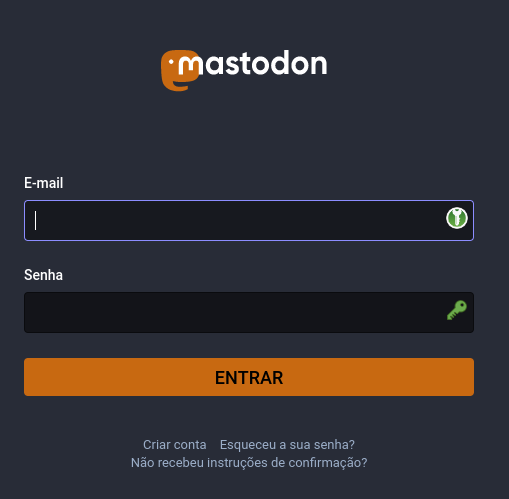
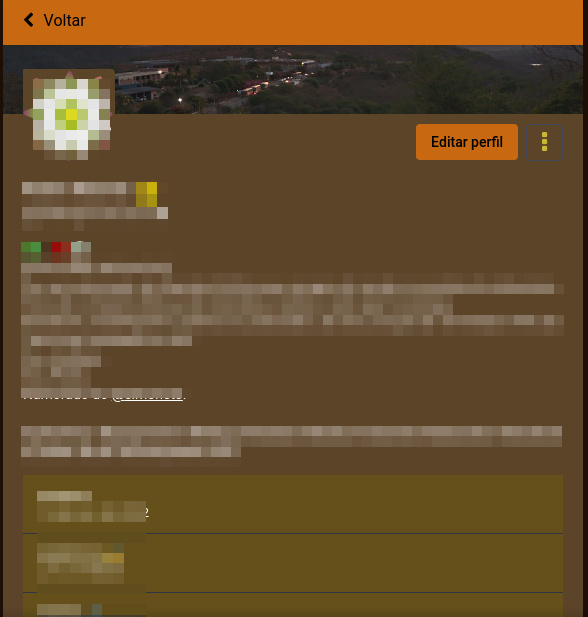
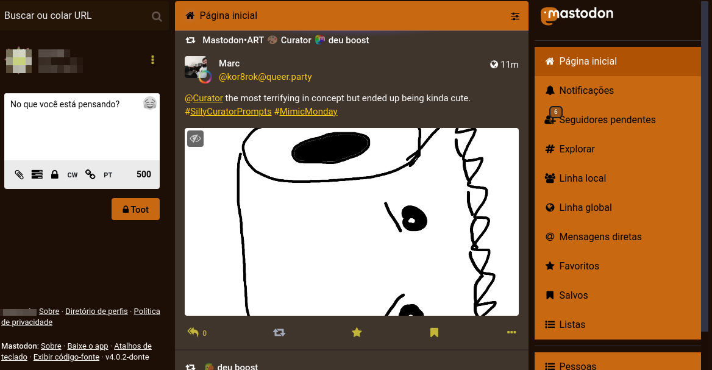

# Tema Mastodon customizado "Crepúsculo"
Esse tema é apenas um código CSS com comentários que facilita que usuáries da rede social Mastodon possam alterar as cores do site. Para usá-lo é preciso instalar alguma extensão de navegador que edita o CSS da página como o [Stylus](http://https://addons.mozilla.org/pt-BR/firefox/addon/styl-us/ "Stylus"). As alterações são feitas apenas localmente portanto não modificam nada no servidor.

**Observação:** As mensagens diretas (DMs) nesse tema apresentam uma coloração diferente dos toots públicos e "apenas seguidores". 

Abaixo algumas capturas de tela do tema aplicado. 

